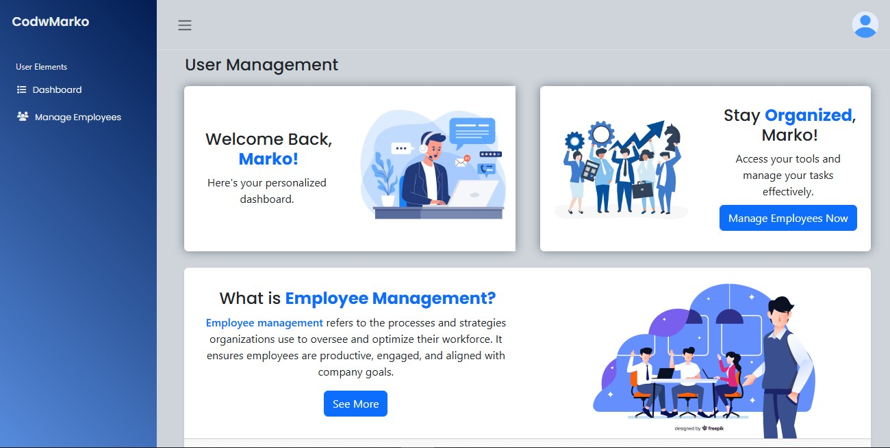
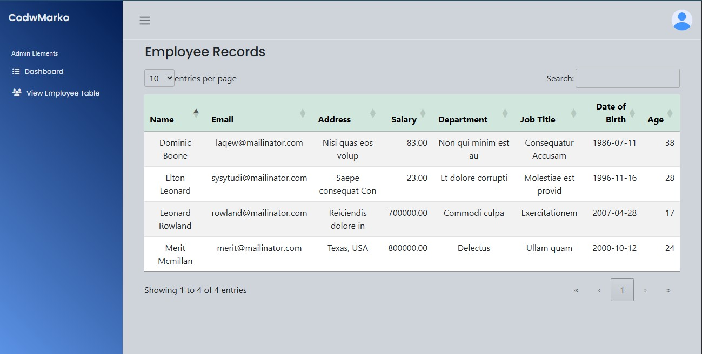
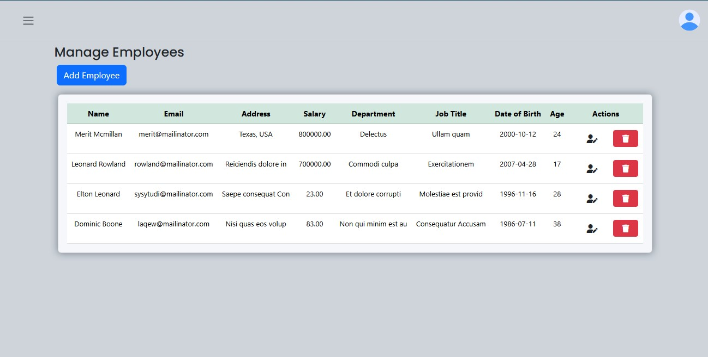

# Employee Management System (CRUD)

  
  
  

This project was part of our **3rd Year – IT Elective 2 (Advanced Database Systems)** course requirement.  
It is a simple Employee Management System built with **PHP**, **MySQL**, and **Bootstrap**.

## 📘 Applied SQL Principles

- **Indexes & Primary Keys** – for efficient lookups and unique identifiers  
- **Unique Constraints** – preventing duplicate usernames in the `logintab` table  
- **Auto Increment Handling** – automatic ID generation for tables  
- **Foreign Key Constraints** – enforcing referential integrity across related tables  
- **Cascade Deletes** – ensuring dependent records are removed consistently  

## 📸 Preview

  
*Employee Dashboard*

  
*Admin Dashboard*

  
*Employee Management (CRUD)*

## 🚀 Features
- Employee CRUD operations
- Role-based login (Admin & Employee)
- Age automatically calculated using triggers
- Responsive UI using Bootstrap
- Database relationships with foreign keys
- Easy to set up and run locally

## 🛠️ Installation & Setup

### 1. Install Required Components
Make sure you have the following installed:
- [XAMPP](https://www.apachefriends.org/) (Recommended) or WAMP/LAMP  
  - **PHP 8+**  
  - **MySQL / MariaDB**  
- [Git](https://git-scm.com/) (optional, for cloning repo)

---

### 2. Clone or Download the Repository
bash
git clone https://github.com/codewmarx/employee-management-system.git
Or download as ZIP and extract into your server’s htdocs folder.

---

### 3. Setup the Database
Open phpMyAdmin from your XAMPP/WAMP control panel.

Create a new database (e.g. empdata).

Import the file empdata.sql from the repo.

---

### 4. Run the Project
Move the project folder into:

C:/xampp/htdocs/ (for Windows + XAMPP)

/var/www/html/ (for Linux + LAMP)

Start Apache & MySQL from the XAMPP control panel.

Open your browser and go to:
perl
Copy code
http://localhost/employee-management-system/

### 🔑 Default Login Credentials  

| Role     | Username        | Password     |
|----------|----------------|--------------|
| Admin    | `admin`        | `admin123`   |
| Employee | `(your_username)` | `(your_password)` |

---

### 👨‍💻 Author  
> **Developed by Mark Anthony Garado**  
> 📌 For simple academic requirements purposes only.  

